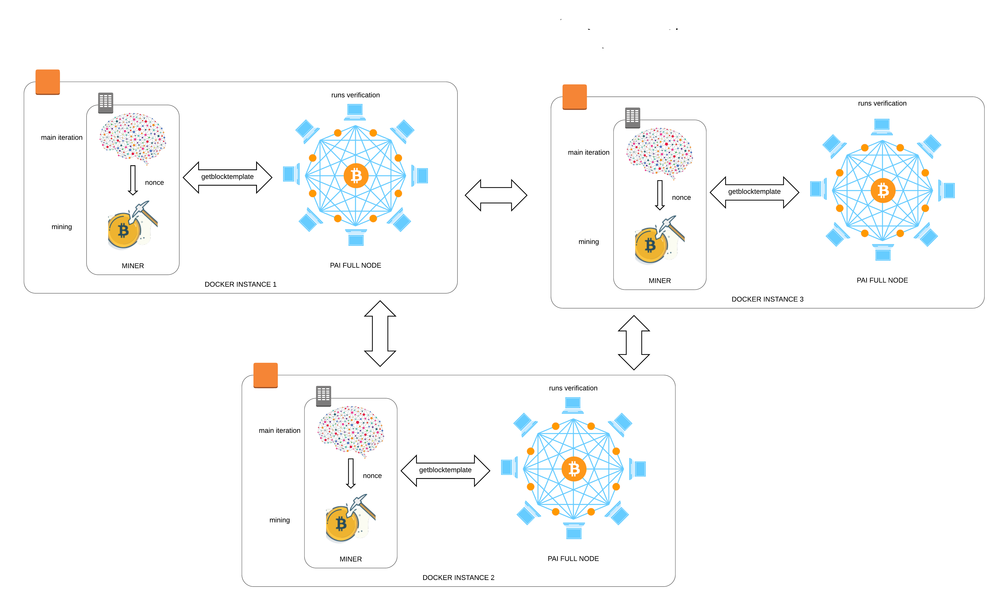
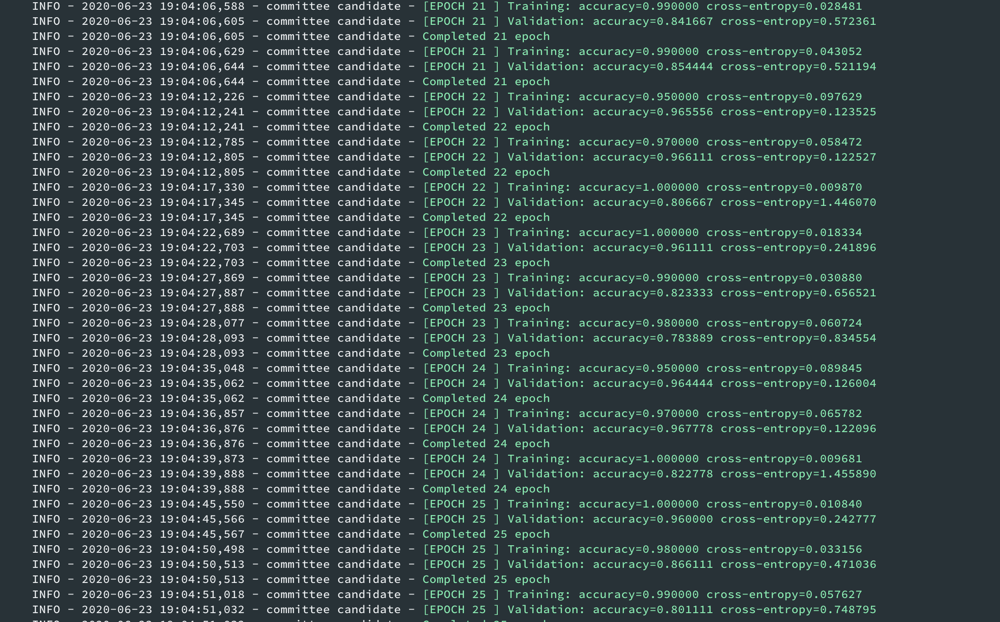
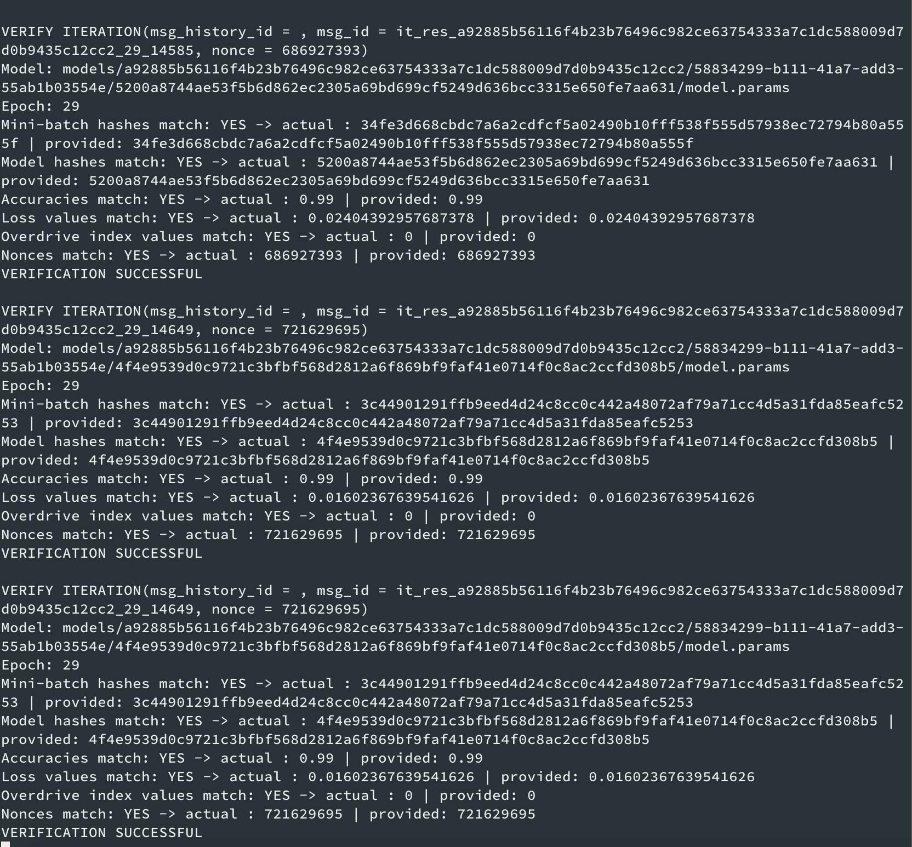
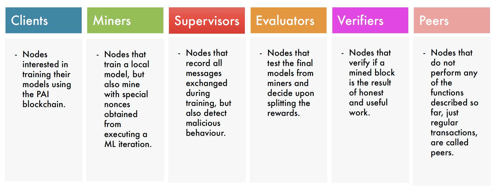
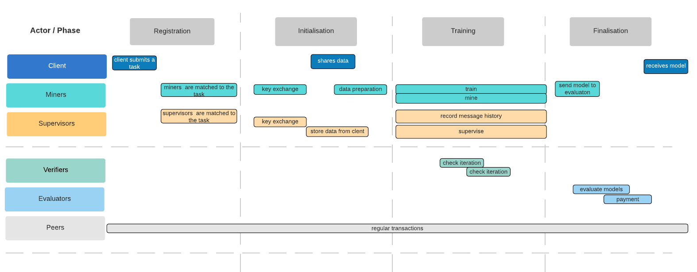
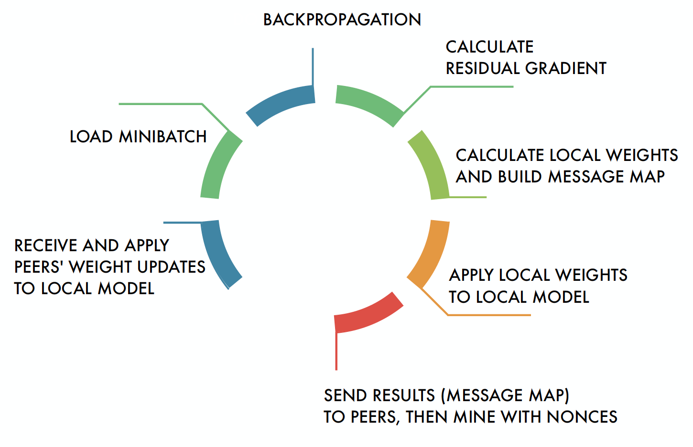
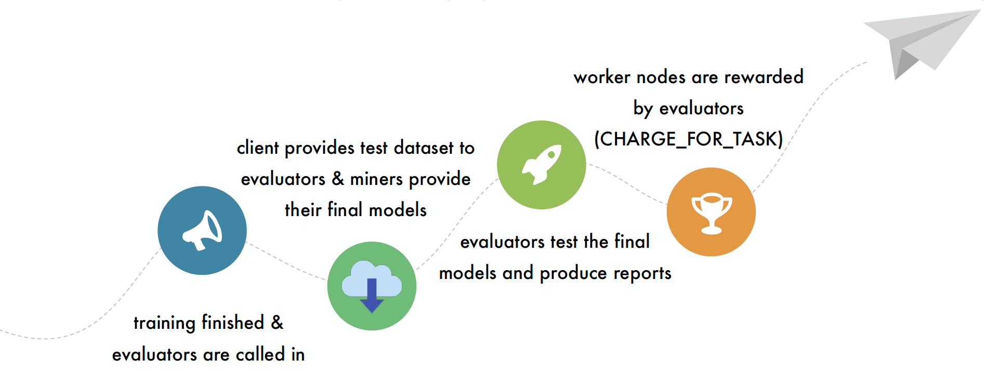
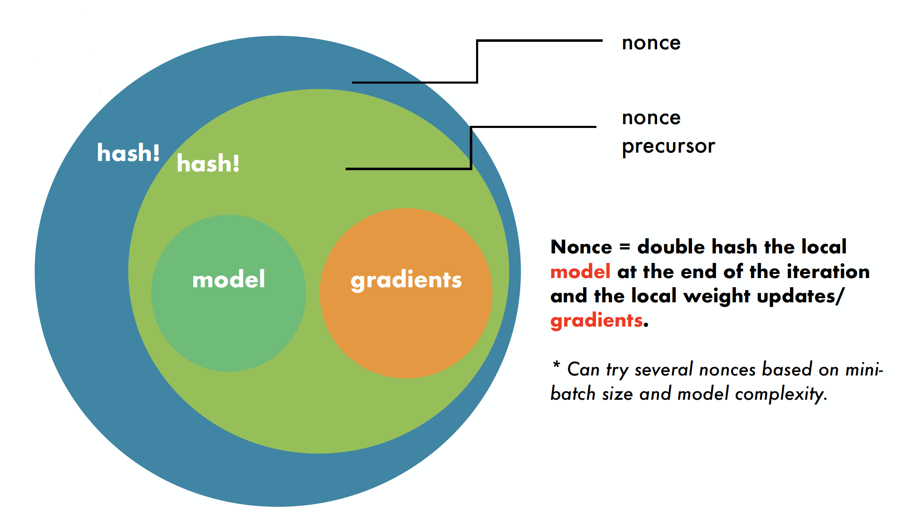

# Proof of Useful Work
  [](https://snyk.io/test/github/projectpai/pouw-main-iteration?targetFile=requirements.txt) [](https://codeclimate.com/github/projectpai/pouw-main-iteration/maintainability)

Proof of Useful Work (PoUW) is a novel blockchain platform with a new type of user, that is additional to the typical blockchain transactor: the requestor. This paradigm shift has a dual purpose: we provide a typical cryptocurrency with the added benefit of a computational platform at an affordable price.

Our requestor model is using machine learning as useful computation. The work is distributed among worker nodes and verifiers. A client (the requestor) can submit a machine learning task along with preferences, the worker nodes are matched to the task, miners train and mine with nonces derived from the ML processing, and at end they are paid from the client's fee. All interactions are sent as special transactions into the blockchain, so they can be later verified.

**PoUW** can be run on **Mac OS X** and **Linux**, but also on derived systems such as **Docker** or **Kubernetes**.


## First look
When blocks are successfully mined we can see an output like this in the PAI blockchain server window:


Meanwhile, the ML training process takes place at a faster pace inside the miner nodes.


## Contents

1. [Quickstart](#Quickstart)
    * [Elements](#Elements)
    * [MacOS&nbsp;via&nbsp;Homebrew](#MacOSviaHomebrew)
2. [How it works](#Howitworks)
    * [Actors](#actors)
    * [Workflow](#Workflow)
    * [ML Training](#ml-training)
    * [Rewarding useful work](#rewarding-useful-work)
    * [No client tasks?](#no-client-tasks)
    * [Staking](#staking)
    * [Mining](#mining)
3. [How to make money](#How-to-make-money)
4. [Try it yourself!](#Try-it-yourself)
5. [License](#license)

## Quickstart
Here is how to run PoUW locally in just 10 simple steps.
### Elements
- **paicoind** is the PAICoin server binary
- **verification/server.py** is the PAICoin server extension that re-runs and verifies ML iterations when a lucky nonce is found by a miner
- **worker.py** contains the mining and training code executed by a miner; **start_cluster.py** is calling it to simulate several miners on the same machine
- **client.py** is the client code that triggers the training and mining processes.

### MacOS&nbsp;via&nbsp;Homebrew
This setup assumes you will be running a local PAICoin node and three ML miners (on the same Apple machine).
This should be used for testing and debugging purposes.

1. Let's clone the PAICoin PoUW branch and the ML trainer extension by running the following commands:
    ~~~~zsh
    git clone -b "pouw-q4" --single-branch https://github.com/projectpai/paicoin.git
    git clone https://github.com/projectpai/pouw-main-iteration
    ~~~~

2. Install the prerequisites to build the PAICoin code and to run the ML trainer extension:
    ~~~zsh
    brew install automake berkeley-db4 libtool boost miniupnpc pkg-config python qt libevent qrencode zmq
    brew install python3 grpc
    ~~~

3. Create a directory `~/Application\ Support/PAIcoin/` where we will add two configuration files:
    ```zsh
    mkdir ~/Library/Application\ Support/PAIcoin/
    cd ~/Library/Application\ Support/PAIcoin/
    ```
4. We'll place here a file called` paicoin.conf` that has the following content:
    ~~~ini
    server=1
    bantime=1
    daemon=0
    rpcuser=paicoin
    rpcpassword=10050021
    rpcport=4002
    testnet=1
    rpcallowip=0.0.0.0/0
    txindex=1
    onlynet=ipv4
    listenonion=0
    maxtipage=31104000
    listen=1
    rpcbind=0.0.0.0
    verificationserver=0.0.0.0:50011
    printtoconsole=1
    connect=0
    ignore-not-connected=1
    dnsseed=0
    ~~~

5. We'll add another file called `chainparams.conf` with this content:
    ```ini
    GENESIS_BLOCK_TIME = 5
    GENESIS_BLOCK_REWARD = 1470000000
    INITIAL_BLOCK_REWARD = 150
    BLOCK_TIME = 5

    TESTNET_CONSENSUS_POW_LIMIT = 01ffffffffffffffffffffffffffffffffffffffffffffffffffffffffffffff
    TESTNET_GENESIS_BLOCK_POW_BITS = 20
    TESTNET_GENESIS_BLOCK_NBITS = 0x2001ffff
    TESTNET_GENESIS_BLOCK_SIGNATURE = 9a8abac6c3d97d37d627e6ebcaf68be72275168b
    TESTNET_GENESIS_BLOCK_UNIX_TIMESTAMP = 1546300800

    TESTNET_PUBKEY_ADDRESS = 51
    TESTNET_SCRIPT_ADDRESS = 180
    TESTNET_SECRET_KEY = 226

    TESTNET_MAGIC_BYTE_0 = 11
    TESTNET_MAGIC_BYTE_1 = 9
    TESTNET_MAGIC_BYTE_2 = 17
    TESTNET_MAGIC_BYTE_3 = 7

    TESTNET_PORT = 18567
    TESTNET_RPC_PORT = 18566

    TESTNET_SEED_0 =
    TESTNET_SEED_1 =
    TESTNET_SEED_2 =
    ```

6. Now we'll switch back to where we cloned the two repositories and we'll build the the PAIcoin blockchain part by running:
    ~~~~zsh
    cd paicoin/
    ./autogen.sh
    ./configure --with-gui=no --disable-tests --disable-bench --enable-chainparams-conf
    make -j $(sysctl -n hw.physicalcpu) 
    ~~~~

7. We'll create the genesis block.
    ~~~~zsh
    cd src/
    ./paicoind -mine-genesis-block
    ~~~~

8. Now, we switch to the Python code and install the ML trainer:
    ~~~~zsh
    cd ../../pouw-main-iteration/
    pip3 install -r requirements.txt
    pip3 install -U setuptools
    python3 setup.py develop
    ~~~~

9. Now, it's already time to run the system.
* Start the verification server, so we type:
    ~~~~zsh
    python3 pai/pouw/verification/server.py
    ~~~~

* In another terminal, we start the *paicoind* process, therefore from the original directory where we initially cloned the repos, we run this:
    ~~~~zsh
    cd paicoin/src/
    ./paicoind -ignore-not-connected
    ~~~~

* We start another terminal in the initial clone directory and we'll start the ML training cluster with 3 nodes:
    ~~~~zsh
    cd pouw-main-iteration/
    python3 pai/pouw/start_cluster.py --nodes-number 3
    ~~~~

* From another terminal we run the client that starts the training process. The output should be similar to this window during the whole process:
    ~~~~zsh
    cd pouw-main-iteration/
    python3 pai/pouw/nodes/decentralized/client.py --client-task-definition-path=pai/pouw/client-task-definition.yaml
    ~~~~
    
    
10. Let's check the results:
* You can open a new Terminal and check with `paicoin-cli` the blockchain status:
    ```zsh
    cd paicoin/src/
    ./paicoin-cli --rpcuser=paicoin --rpcpassword=10050021 --rpcport=4002 getmininginfo
    ```
    
* While the mining and training is taking place, you can see the verifications in the output window of `server.py`:
    .

## How&nbsp;it&nbsp;works
The environment is the PAI (Personalised Artificial Intelligence) blockchain, a hybrid Proof of Work/Proof of Stake (PoW/PoS) blockchain. It is a P2P decentralised network composed of various actor types to ensure security.

### Actors

The system has 6 types of actors:
- clients
- miners
- supervisors
- evaluators
- verifiers
- peers

Clients are interested to have their models trained a good price, miners perform the actual training, supervisors log the ML task activity and audit for malicious behaviour, evaluators decide how to split the client's fee, verifiers do delegated verification when a miner finds a lucky nonce and peers are regular transactors.

### Workflow
Here is a typical task workflow:

In the first phase, called __Registration__, a client submits a ML task and miners and supervisors are assigned automatically based on a matching algorithm. Then in the __Initialisation__ phase, the worker nodes exchange their cryptographic keys with each other, the client shares the training data and this data is prepared for training and stored on the worker nodes. Data is split into very small batches, each batch will be processed in an iteration. During the next phase, __Training__, miners will perform the distributed machine learning training. When a miner finishes to process an iteration (there can be thousands, millions of iterations), it is allowed to try to mine with a nonce obtained from specifics of that iteration. If it finds a lucky nonce, it will hand over the inputs and the data to several verifiers, who can certify that the nonce was obtained correctly. During this time, supervisors audit the whole training process. In the __Finalisation__ phase, our protocol will pick up a set of evaluators, who decide how to split the client's fee.

### ML Training
We use an asynchronous ML training algorithm. The whole training dataset is split into small pieces, called batches. These pieces are given to miners to process. Every miner has a set of its own batches to process in a predetermined order. At the same time, every miner also has a copy of the ML model. At every iteration, it processes a batch, updates its model and tells the other miners what changes it applied to its model. The other miners listen to these kinds of messages and update their own models with these changes, while also performing their own work.


During a ML iteration the miner receives gradient updates and applies them to its local model, then loads its assigned mini-batch for this iteration. Then it’s the usual backpropagation, after which we obtain gradients. To minimize the sent data, we send only significant values for gradients. We use an accumulation scheme: we keep a gradient residual and everything that exceeds a threshold is encoded in a map, applied to the local model and announced over the network. Eventually, all changes to gradients are applied to the local model with a delay. After this is done, the miner is allowed to mine.

### Rewarding useful work
At the end of the training, a number of evaluators are selected, they are provided with the models from each miner and the test dataset from the client. Very important: nobody sees the client dataset until this stage. Evaluators just test the models on the test dataset and decide how to split the client’s money across the ML training participants, that include the miners, supervisors, and evaluators themselves. Then, the best model is handed to the final beneficiary, which is the client, the requestor.


You might ask yourself: Is this feasible in practice? Yes. I would like to mention that we tested ML task groups of up to 80 participants that still converged to a good solution with this distributed setup.

### No client tasks?
What happens when there are times when no requestor asks for computation? We have fill-in tasks designed by Project PAI, such as protein folding, that can be solved using ML. Once defined, we can add here computational tasks that could help with finding a cure or vaccine to Covid-19 and so on. The model architecture and parameters are randomly generated, so there are no repeat-jobs.

### Staking
How about bad behaviour, cheating, doing cheap work? There are two protections in place: the architecture of the system and staking. We ensure good behaviour using staking. All nodes stake coins to participate. If they do proper work, stakes are returned, otherwise they are confiscated and added to the task fee and redistributed to honest actors at the end of training. Staking is our first differentiator. This makes our platform different from others.

### Mining

Our second differentiator is the ML-based mining. We enforce useful work by linking mining to AI-work. Every nonce is restricted to a value that can only be obtained after executing a ML iteration. Without getting into very technical details, a nonce is deterministically derived from the model state at the end of the iteration and the gradients applied during iteration. A miner is allowed to try an interval of nonces based on model complexity and batch size.

## How to make money
All participants benefit from PoUW. 
- Miners have 2 income sources:
    - paid by client in a descending order based on the final model metrics
    - from actual mining.

- Supervisors and evaluators get an equal share from a quota of the client share.
- Verifiers are paid by miners, clients have lower computation costs
- Peers win by holding PAI-Coin as a long-term investment.

## Try it yourself!
We have done significant work in regards to bringing this idea to reality. We also have a comprehensive Kubernetes tutorial at https://github.com/projectpai/pouw-k8s, that you can follow and deploy a network of PoUW nodes on your local computer. You can clone the repositories, explore the code, build and run the implementations, modify the code, submit your proposals and become a PoUW contributor!

## License
PoUW is distributed under the [MIT License](LICENSE).